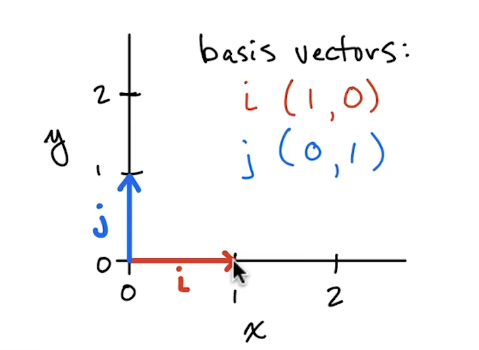
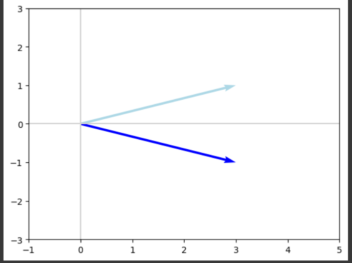
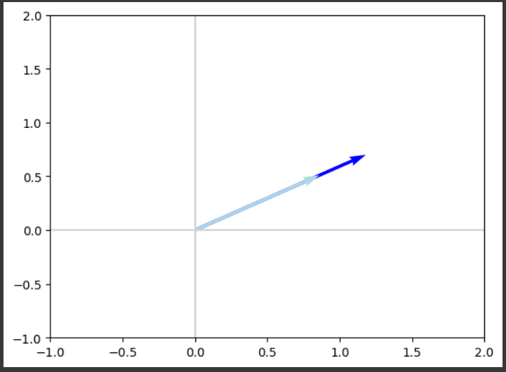
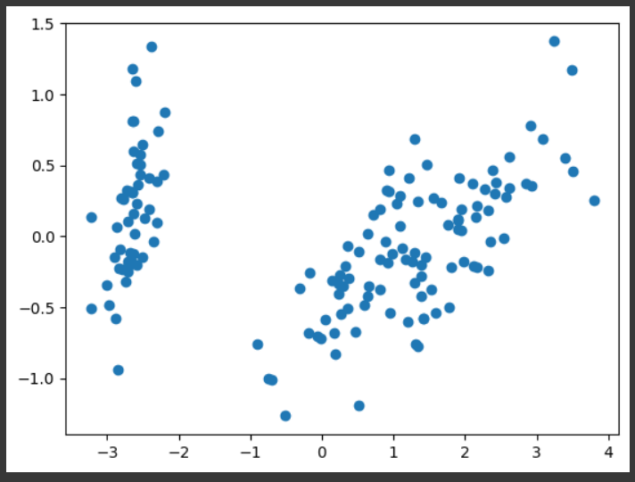

# Mathematical Foundations of Machine Learning
Linear Algebra and Mathematics for Machine Learning

## Intro to Linear Algebra
- Algebra is arithmetic that includes non-numerical entities like x:
- 2x + 5 = 25
- 2x = 20
- x = 10
- If it has an exponential term, it isnt linear algebra:
- 
- Linear Algebra is solving for unknowns within system of linear equations 
- 
- 
- 
- Note if the sheriff car is same speed as bank robber, there is no solution
- Also if they both start at the same time and same speed, there could be infinite solutions
- We can use the matplotlib library in python to plot this(Scott Plot in c#)
```python

import numpy as np
import matplotlib.pyplot as plt
t = np.linspace(0, 40, 1000) # start, finish, n points

d_r = 2.5 * t # Distance travelled by robber

d_s = 3 * (t-5) # Distance travelled by sheriff

fig, ax = plt.subplots()
plt.title('A Bank Robber Caught')
plt.xlabel('time (in minutes)')
plt.ylabel('distance (in km)')
ax.set_xlim([0, 40])
ax.set_ylim([0, 100])
ax.plot(t, d_r, c='green')
ax.plot(t, d_s, c='brown')
plt.axvline(x=30, color='purple', linestyle='--')
_ = plt.axhline(y=75, color='purple', linestyle='--')

```
- 
- 
- 
- Here 'a' is the average house price
- The above is an example of a regression model
- 
- Contemporary applications of Linear Algebra
- 


## Tensors
- Tensors are basically ML generalization of vectors and matrices to any number of dimensions
- zero dimensional tensor is a scalar 
- 

### Scalar Tensors
- They have no dimensions
- They are a single number
- Denoted in lowercase, italics eg: x
- Should be typed, like all other tensors: e.g int,float 
- Scalars (Rank 0 Tensors) in Base Python
```python
x = 25
x # Output is 25

type(x) # Output is int 

y=3
py_sum = x + y 
py_sum # Output is 28

type(py_sum) # Output is int

x_float = 25.0
float_sum = x_float + y 
float_sum # Output is 28.0

type(float_sum) # Output is float
```
- PyTorch and TensorFlow are the two most popular automatic differentiation libraries
### PyTorch tensors are designed to be pythonic, i.e., to feel and behave like NumPy arrays.
- The advantage of PyTorch tensors relative to NumPy arrays is that they easily be used for operations on GPU(many parallel matrix processing, useful for ML algorithms)
- We can make scalars in PyTorch also like this 
```python
import torch
x_pt = torch.tensor(25) # type specification optional, e.g.: dtype=torch.float16
x_pt # Output is tensor(25)

x_pt.shape #Output is torch.Size([])

```
### Scalars in TensorFlow can be done like this 
- Tensors created with a wrapper, all of which you can read about here:
- tf.Variable
- tf.constant
- tf.placeholder
- tf.SparseTensor
- Most widely-used is tf.Variable, which we'll use here.

As with TF tensors, in PyTorch we can similarly perform operations, and we can easily convert to and from NumPy arrays.
```python
import tensorflow as tf
x_tf = tf.Variable(25, dtype=tf.int16) # dtype is optional
x_tf # Output is <tf.Variable 'Variable:0' shape=() dtype=int16, numpy=25>

x_tf.shape # Output is TensorShape([])

y_tf = tf.Variable(3, dtype=tf.int16)
x_tf + y_tf #Output <tf.Tensor: shape=(), dtype=int16, numpy=28>

tf_sum = tf.add(x_tf, y_tf)
tf_sum #Output is <tf.Tensor: shape=(), dtype=int16, numpy=28>

tf_sum.numpy() # note that NumPy operations automatically convert tensors to NumPy arrays, and vice versa

type(tf_sum.numpy()) #Output is numpy.int16

tf_float = tf.Variable(25., dtype=tf.float16)
tf_float #Output is <tf.Variable 'Variable:0' shape=() dtype=float16, numpy=25.0>

```
### Vectors and Vector Transposition
- Vectors are one-dimensional array of numbers 
- Denoted in lowercase italics, bold e.g: **x**
- Arranged in an order so element can be accessed by its index
- Elements of a vector are scalar so not bold
- Vectors represent a particular in space 
- Vector of length 2 represents a location in a 2D Matrix
- 
- Vector of length 3 represents location in a 3D cube
- Vector of length n represents location in n-dimensional tensor(difficult to imagine visually, but computers can handle it !)
- Vector Transposition-->Transforms a vector from row-vector to column-vector and vice-versa
- 
- Note how the shape of the vector goes from (1,3) to (3,1)
```python
x = np.array([25, 2, 5]) # type argument is optional, e.g.: dtype=np.float16
x #Output array([25,  2,  5])

len(x) # Output is 3

x.shape # Output is (3,)

type(x) # Output is numpy.ndarray

x[0] # Output is 25 

type(x[0]) # Output is int64

# Vector Transposition
# Transposing a regular 1-D array has no effect...
x_t = x.T # Add .T in front of any vector and it will transpose it for us
x_t # Output is array([25,  2,  5])

x_t.shape # Output is (3,)

# ...but it does we use nested "matrix-style" brackets:
y = np.array([[25, 2, 5]])
y # Output is array([[25,  2,  5]])

y.shape # Output is (1,3)

# ...but can transpose a matrix with a dimension of length 1, which is mathematically equivalent:
y_t = y.T
y_t #Output is array([[25],
                    # [ 2],
                    #[ 5]])

y_t.shape # this is a column vector as it has 3 rows and 1 column
#Output is (3,1)

# Column vector can be transposed back to original row vector:
y_t.T #Output is array([[25,  2,  5]])

y_t.T.shape() # Output is (1,3)

```

### Zero Vectors
- Have no effect if added to another vector
```python
z = np.zeros(3)
z # Output is array([0., 0., 0.])

x_pt = torch.tensor([25, 2, 5])
x_pt #Output is tensor([25,  2,  5])

```

### Please note that Vectors not only represent a point in space but can also represent a magnitude and direction in space
- Remember vectors represent a point in space like this
- 
- We can also think of them as representing direction and magnitude like this 
- 
- Norms are a class of functions that quantify the vector magnitude(or its length)
- They describe the distance from the origin(say (0,0,0))
- Most common is L2 norm
- We take each element in our vector, square them and then add them and then take their square root 
- 
- This L2 norm measures the simple (euclidean) distance from origin(looks like pythogoras theorem)
- It is the most common norm in machine learning 
- 
```python
x # Output is [25,2,5]
(25**2 + 2**2 + 5**2)**(1/2) # Output is 25.573423705088842

# Get the norm
np.linalg.norm(x) #Output is np.float64(25.573423705088842)

```
- So, if units in this 3-dimensional vector space are meters, then the vector  x  has a length of 25.6m

### Unit Vectors 
- Special case where its length or L2 norm is equal to 1 
- Technically, x is a unit vector with unit norm i.e ||**x**|| = 1
- 
- There are other norms also

### L1 norm
- 
- Common norm in ML
- Varies linearly at all locations whether near or far from origin
- Used whenever difference between zero and non zero is the key
```python
x # Output is []
np.abs(25) + np.abs(2) + np.abs(5) #Output is 32

```
### Squared L^2 norm
- 
- Here it is same as L2 norm but we dont use the square root 
- 
```python
x #Output is [25,2,5]

(25**2 + 2**2 + 5**2) #Output is 654

# we'll cover tensor multiplication more soon but to prove point quickly:
np.dot(x, x) #Output is 654 (This is x * transpose(x))

```

### Max Norm(or L(infinity) norm)
- 
- 
```python
np.max([np.abs(25), np.abs(2), np.abs(5)]) #Output is 25

```

### Generalized Lp norm
- 
- 


## Basis, Orthogonal and Orthonormal Vectors
- Basis vectors can be scaled to represent any vector in a given vector space
- Typically use unit vectors along axes of vector space(shown)
- 

### Orthogonal Vectors
- x and y are orthogonal vectors if x^t * y = 0
- It means vectors are 90 degree angle to each other 
- 

### Orthonormal vectors 
- Orthonormal vectors are orthogonal and all have unit norm
- Basis vectors are an example
- 
```python
i = np.array([1, 0])
i #Output is [1,0]

j = np.array([0, 1])
j #Output is [0,1]

np.dot(i, j) #Output is 0

```

## 2-Dimensional Tensors(also called Matrices)
- Matrix is a 2 dimensional array of numbers 
- 
- Denoted in uppercase, italics and bold 
- If Matrix X has 3 rows and 2 columns, its shape is (3,2)
- Individual scalar elements are denoted in uppercase, italics only 
- 
- Matrices in NumPy
- 
- 
- Matrices in PyTorch
- 
- Matrices in TensorFlow 
- 

## Generic Tensor Notation
- We can generalize our notation to be able to represent tensors with any number of dimensions, including the high dimensional tensors that are common behind the scenes in machine learning models.
- 
- As an example, rank 4 tensors are common for images, where each dimension corresponds to:
- Number of images in training batch, e.g., 32
- Image height in pixels, e.g., 28 for MNIST digits
- Image width in pixels, e.g., 28
- Number of color channels, e.g., 3 for full-color images (RGB)
```python
images_pt = torch.zeros([32, 28, 28, 3]) #Create a 4D tensor with these sizes
images_pt #Output would be tensor([[[[0., 0., 0.],
          #[0., 0., 0.],
          #[0., 0., 0.],
          #...,
          #[0., 0., 0.],
          #[0., 0., 0.],
          #[0., 0., 0.]],

         #[[0., 0., 0.],
          #[0., 0., 0.],
          #[0., 0., 0.],
          #...,

```
- 
- 

## Common Tensor Operations
- Here we will do the following operations:
- 

### Tensor Transposition
- 
- 

### Basic Tensor Arithmetic(including Hadamard Product)
- 
- 
- 
- If two tensors have the same size, operations are often by default applied element-wise. This is not **matrix multiplication**, but is rather called the **Hadamard product** or simply the **element-wise product**.
- The mathematical notation is  A⊙X
- 

### Tensor Reduction
- Calculating the sum across all elements of a tensor is a common operation. For example:
- 
- 
- We can do the sum in a 2D tensor along rows and columns also like this 
- 
- Many other operations can be applied with reduction along all or a selection of axes, e.g.:
- maximum
- minimum
- mean
- product
- They're fairly straightforward and used less often than summation

## Dot Product of 2 Vectors
- 
- The dot product is ubiquitous in deep learning: It is performed at every artificial neuron in a deep neural network, which may be made up of millions (or orders of magnitude more) of these neurons.
- 
- Use it in PyTorch like this 
- 
- Use it in TensorFlow like this
- 
- 
- 

## Solving Linear Systems with Substitution
-  We can use matrices to solve some simple linear systems computationally i.e using code.
-  
-  
-  

## Solving Linear Systems with Elimination
- 
- 
- 
- 
```python
x = np.linspace(-10, 10, 1000) # start, finish, n points
y1 = -5 + (2*x)/3
y2 = (7-2*x)/5
fig, ax = plt.subplots()
plt.xlabel('x')
plt.ylabel('y')

# Add x and y axes:
plt.axvline(x=0, color='lightgray')
plt.axhline(y=0, color='lightgray')

ax.set_xlim([-2, 10])
ax.set_ylim([-6, 4])
ax.plot(x, y1, c='green')
ax.plot(x, y2, c='brown')
plt.axvline(x=6, color='purple', linestyle='--')
_ = plt.axhline(y=-1, color='purple', linestyle='--')

```
- 


## Matrix Properties
- We will look at the following items:
- 

### Frobenius Norm
- It is a function that enables us to quantify the size of a matrix.
- 
- 

### Matrix Multiplication
- Most widely used operation in Machine Learning
- First rule is that if we are multiplying 2 matrices, then number of columns in the first matrix should be equal to the number of rows in the second matrix.
- When we multiply the above 2 matrices, we get a new matrix where number of rows is equal to the rows of the first matrix and number of columns is equal to the number of columns in the second matrix. 
- 
- 
- 
- 
- In Pytorch we can do it like this 
- 
- In Tensor flow we can do it like this 
- 
- 
- 
- Note that AB <> BA
- 
- We can do it in PyTorch as follows:
- 
- Remember this algorithm where we were trying to predict the price of a house 
- 
- Note that we have a set of data points to train this regression model 
- Note that every row represents a specific house.
- We can represent this in matrix form like this 
- 

### Symmetry and Identity Matrices
- Symmetric is a special kind of matrix which has following properties
- It should be square
- Its transpose should be equal to the matrix itself
- 
- 
- Identity Matrix is a symmetric matrix where every element along diagonal is 1
- All other elements are 0
- 
- 
- Take an n length vector and multiply it by the identity matrix then it remains unchanged.
- 
- 

### Matrix Inversion
- It is clever convenient approach for solving linear equations
- An alternative to manually solving with substitution or elimination
- Matrix inverse of X is denoted as X^-1
- Multiplying a matrix by its inverse results in the identity matrix
- 
- Remember the house prices example
- 
- 
- 
- 
- 
- There are limitations to applying Matrix inversions 
- 
- Note that columns should not be multiples of other columns
- Another problem with Matrix inversion is that it can only be calculated if the matrix is a square i.e its rows and cols are the same. 
- 
- 
- Note that -4,-8 is a multiple of 1,2, so its a singular matrix so we cannot calculate its inverse.
- Similarly if we try to invert a non-square matrix, then we get an error also.

### Diagonal Matrix
- Has non-zero elements along main diagonal; zeros everywhere
- Identity matrix is an example of a diagonal matrix, its a special type of diagonal matrix.
- 

### Orthogonal Matrix
- Recall orthonormal vectors from earlier, i.e vectors which are perpendicular to each other. Doing their dot products results in 0. Basis vectors were an example
- 
- 
- 
- 
- Note that that the rows and columns are orthonormal, i.e they have unit norm(size is 1) and doing their dot product with other rows and columns of the matrix results in 0
- We can prove this using NumPy also 
- 
- 
- 
- 
- 
- 
- 
- 
- We've now determined that, in addition to being orthogonal, the columns of $K$ have unit norm, therefore they are orthonormal.
- To ensure that $K$ is an orthogonal matrix, we would need to show that not only does it have orthonormal columns but it has orthonormal rows are as well. Since $K^T \neq K$, we can't prove this quite as straightforwardly as we did with $I_3$.
- One approach would be to repeat the steps we used to determine that $K$ has orthogonal columns with all of the matrix's rows (please feel free to do so). Alternatively, we can use an orthogonal matrix-specific equation from the slides, $A^TA = I$, to demonstrate that $K$ is orthogonal in a single line of code
- 

## Eigenvectors and EigenValues
- Here we will use Tensors in Python to solve system of equations and identifying meaningful patterns in data
- **Determinant of a matrix** is a scalar that provides key information about how a matrix transforms other tensors.
- **Singular Value Decomposition** is used to compress data by decreasing the size of a matrix while retaining its most informative components.
- **Moore-Penrose-Pseudoinverse** is a hugely useful tool that enables us to solve for unknown values in linear systems that aren't appropriate for ordinary matrix inversion, such as the overdetermined systems of equations that are typical of machine learning.

### Review of Linear Algebra
- Solving for unknowns in a system of equations
- Remember sheriff-bank robber car example 
- 
- 
- 
- 
- 
- Linear algebra can used to solve for unknowns in ML algos, including deep learning.
- We can reduce dimensionality (e.g principal component analysis)
- Linear algebra is great for ranking results(e.g with eigenvector, including in Google Page Rank algorithm)
- Linear Algebra is good for recommender systems like movie recommendations in Netflix(SVD)
- Good for NLP(e.g SVD, Matrix Factorization)
- 
- 
- 
- 
- 
- 
- 
- 
- 
- Remember overdeterminations and underdeterminations
- 

### Applying Matrices
- All that "Applying Matrices" means is perform Matrix Multiplication
- 
- 
- 
- 
- 
- 


### Affine Transformations
- These are particularly useful transformations like flipping and or rotating that we carry out by applying matrices.
- 
- Let's plot  v  using my plot_vectors() function (which is based on Hadrien Jean's plotVectors() function
```python
v = np.array([3, 1])
v # Output is array([3, 1])

import matplotlib.pyplot as plt
def plot_vectors(vectors, colors):
    """
    Plot one or more vectors in a 2D plane, specifying a color for each. 

    Arguments
    ---------
    vectors: list of lists or of arrays
        Coordinates of the vectors to plot. For example, [[1, 3], [2, 2]] 
        contains two vectors to plot, [1, 3] and [2, 2].
    colors: list
        Colors of the vectors. For instance: ['red', 'blue'] will display the
        first vector in red and the second in blue.
        
    Example
    -------
    plot_vectors([[1, 3], [2, 2]], ['red', 'blue'])
    plt.xlim(-1, 4)
    plt.ylim(-1, 4)
    """
    plt.figure()
    plt.axvline(x=0, color='lightgray')
    plt.axhline(y=0, color='lightgray')

    for i in range(len(vectors)):
        x = np.concatenate([[0,0],vectors[i]])
        plt.quiver([x[0]], [x[1]], [x[2]], [x[3]],
                   angles='xy', scale_units='xy', scale=1, color=colors[i],)


# Run the above program like this
plot_vectors([v], ['lightblue'])
plt.xlim(-1, 5)
_ = plt.ylim(-1, 5)

```
- Result is the following:
- 
- "Applying" a matrix to a vector (i.e., performing matrix-vector multiplication) can linearly transform the vector, e.g, rotate it or rescale it.
- The identity matrix, introduced earlier, is the exception that proves the rule: Applying an identity matrix does not transform the vector as shown below:

```python

v = np.array([3, 1])
v # Output is array([3, 1])

I = np.array([[1, 0], [0, 1]])
I # Output is array([[1, 0],
                    #[0, 1]])
Iv = np.dot(I, v)
Iv # Output is array([3, 1])

plot_vectors([Iv], ['blue'])
plt.xlim(-1, 5)
_ = plt.ylim(-1, 5)

```
- Result is the same as earlier when we just plotted the vector in light-blue color
- 

- In contrast, consider this non-identity matrix (let's call it  E ) that flips vectors over the  x -axis:

```python

v = np.array([3, 1])
v # Output is array([3, 1])

E = np.array([[1, 0], [0, -1]])
E # Output is array([[ 1,  0],
                    #[ 0, -1]])

Ev = np.dot(E, v)
Ev #Output is array([ 3, -1])

plot_vectors([v, Ev], ['lightblue', 'blue'])
plt.xlim(-1, 5)
_ = plt.ylim(-3, 3)

```
- Result is 

- Lets consider another matrix F, that flips vectors over the y-axis
```python
F = np.array([[-1, 0], [0, 1]])
F # Output is array([[-1,  0],
                    #[ 0,  1]])
Fv = np.dot(F, v)
Fv #Output is array([-3,  1])

plot_vectors([v, Fv], ['lightblue', 'blue'])
plt.xlim(-4, 4)
_ = plt.ylim(-1, 5)
```
- Result is 
- 
- Applying a flipping matrix is an example of an **affine transformation**: a change in geometry that may adjust distances or angles between vectors, but preserves parallelism between them.
- In addition to flipping a matrix over an axis (a.k.a., reflection), other common affine transformations include:
- Scaling (changing the length of vectors)
- Shearing (example of this on the Mona Lisa coming up shortly)
- Rotation
- A single matrix can apply multiple affine transforms simultaneously (e.g., flip over an axis and rotate 45 degrees). As an example, let's see what happens when we apply this matrix  A  to the vector  v :
  
```python
v = np.array([3, 1])
v # Output is array([3, 1])

A = np.array([[-1, 4], [2, -2]])
A #Output is array([[-1,  4],
                   #[ 2, -2]])

Av = np.dot(A, v)
Av #Output is array([1, 4])

plot_vectors([v, Av], ['lightblue', 'blue'])
plt.xlim(-1, 5)
_ = plt.ylim(-1, 5)

```
- Result is 
- We can concatenate several vectors together into a matrix (say, $V$), where each column is a separate vector. Then, whatever linear transformations we apply to $V$ will be independently applied to each column (vector): 
```python
v = np.array([3, 1])
v # Output is array([3, 1])
v2 = np.array([2, 1])

# recall that we need to convert array to 2D to transpose into column, e.g.:
np.matrix(v).T 

v3 = np.array([-3, -1]) # mirror image of v over both axes
v4 = np.array([-1, 1])

V = np.concatenate((np.matrix(v).T, 
                    np.matrix(v2).T,
                    np.matrix(v3).T,
                    np.matrix(v4).T), 
                   axis=1)
V #Output is matrix([[ 3,  2, -3, -1],
                    #[ 1,  1, -1,  1]])

IV = np.dot(I, V)
IV #Output is matrix([[ 3,  2, -3, -1],
                    # [ 1,  1, -1,  1]])

A = np.array([[-1, 4], [2, -2]])
A #Output is array([[-1,  4],
                   #[ 2, -2]])
AV = np.dot(A, V)
AV #Output is matrix([[ 1,  2, -1,  5],
                     #[ 4,  2, -4, -4]])

# function to convert column of matrix to 1D vector: 
def vectorfy(mtrx, clmn):
    return np.array(mtrx[:,clmn]).reshape(-1)

vectorfy(V, 0) #Output is array([3, 1])

plot_vectors([vectorfy(V, 0), vectorfy(V, 1), vectorfy(V, 2), vectorfy(V, 3),
             vectorfy(AV, 0), vectorfy(AV, 1), vectorfy(AV, 2), vectorfy(AV, 3)], 
            ['lightblue', 'lightgreen', 'lightgray', 'orange',
             'blue', 'green', 'gray', 'red'])
plt.xlim(-4, 6)
_ = plt.ylim(-5, 5)

```
- Result is 
- Affine transformations are linear transformations followed by translation. They are useful because they allow geometric manipulations while maintaining the basic structure of objects. For example, in your pharmacy management system, affine transformations might be useful in data visualization when adjusting graphs or plots to different scales or orientations. 

## Eigenvectors and Eigenvalues
- 
- 
- Being on same span means being on the same line
- Note in shearing matrix, the Red vector is knocked off its span, but blue vector is not. 
- So blue vector is an eigenvector but not the red vector.
- **Eigenvalues** are scalar values that tell you how much the eigenvectors length has changed as a result of applying the particular matrix that we're applying.
- 
- If eigenvector were to double in length, its eigenvalue = 2; if it halves, eigenvalue = 0.5, if we fip and shear, then eigenvalue = -1
- 
- Similarly if the eigenvector were to double in length, while reversing direction, eigenvalue would be -2
- An **eigenvector** (*eigen* is German for "typical"; we could translate *eigenvector* to "characteristic vector") is a special vector $v$ such that when it is transformed by some matrix (let's say $A$), the product $Av$ has the exact same direction as $v$.
- An **eigenvalue** is a scalar (traditionally represented as $\lambda$) that simply scales the eigenvector $v$ such that the following equation is satisfied: 
- $Av = \lambda v$
- This is rather confusing, on the left-side we are applying a matrix to a vector and on the right-side we are applying a scalar to a vector
- Eigenvectors and eigenvalues can be derived algebraically (e.g., with the QR algorithm, which was independently developed in the 1950s by both Vera Kublanovskaya and John Francis), however this is outside scope of the ML Foundations series. We'll cheat with NumPy eig() method, which returns a tuple of:
- a vector of eigenvalues
- a matrix of eigenvectors
- Essentially, eigenvectors and eigenvalues act as magnifying glasses: they help you focus on the most meaningful directions and magnitudes of change in your data or systems. It's like having a secret tool that cuts through complexity so you can make smarter decisions.
- 
- 
```python
A = np.array([[-1, 4], [2, -2]])
A #Output is array([[-1,  4],
                   #[ 2, -2]])


lambdas, V = np.linalg.eig(A) 
# The matrix contains as many eigenvectors as there are columns of A:
V #Output is array([[ 0.86011126, -0.76454754],
                   #[ 0.51010647,  0.64456735]])

# With a corresponding eigenvalue for each eigenvector:
lambdas #Output is array([ 1.37228132, -4.37228132])

# Let's confirm that  Av=λv  for the first eigenvector:

v = V[:,0] 
v # Output is array([0.86011126, 0.51010647])

lambduh = lambdas[0] # note that "lambda" is reserved term in Python
lambduh #Output is np.float64(1.3722813232690143)

Av = np.dot(A, v)
Av #Output is array([1.18031462, 0.70000958])

lambduh * v #Output is array([1.18031462, 0.70000958])

plot_vectors([Av, v], ['blue', 'lightblue'])
plt.xlim(-1, 2)
_ = plt.ylim(-1, 2)


# again for the second eigenvector of A:
v2 = V[:,1]
v2 #Output is array([-0.76454754,  0.64456735])

lambda2 = lambdas[1]
lambda2 #Output is -4.372281323269014

Av2 = np.dot(A, v2)
Av2 #Output is array([ 3.34281692, -2.81822977])

lambda2 * v2 #Output is array([ 3.34281692, -2.81822977])

plot_vectors([Av, v, Av2, v2], 
            ['blue', 'lightblue', 'green', 'lightgreen'])
plt.xlim(-1, 4)
_ = plt.ylim(-3, 2)

```
- Result for the first one is 
- Result for the second plot is 

### Eigenvectors in greater than 2 dimensions
- While plotting gets trickier in higher-dimensional spaces, we can nevertheless find and use eigenvectors with more than two dimensions. Here's a 3D example (there are three dimensions handled over three rows):
```python
X = np.array([[25, 2, 9], [5, 26, -5], [3, 7, -1]])
X #Output is array([[25,  2,  9],
                   #[ 5, 26, -5],
                   #[ 3,  7, -1]])
lambdas_X, V_X = np.linalg.eig(X)
V_X #Output is array([[-0.71175736, -0.6501921 , -0.34220476],
                     #[-0.66652125,  0.74464056,  0.23789717],
                     #[-0.22170001,  0.15086635,  0.90901091]])

lambdas_X # a corresponding eigenvalue for each eigenvector
    #Output is array([29.67623202, 20.62117365, -0.29740567])

# Confirm  Xv=λv  for an example eigenvector:
v_X = V_X[:,1] 
v_X #Output is array([-0.6501921 ,  0.74464056,  0.15086635])

lambda_X = lambdas_X[1] 
lambda_X #Output is np.float64(20.62117365053535)

np.dot(X, v_X) # matrix multiplication
# Output is array([-13.40772428,  15.3553624 ,   3.11104129])

lambda_X * v_X
#Output is array([-13.40772428,  15.3553624 ,   3.11104129])
# As you can see Xv = λv

```

### Matrix Determinants
- A determinant is a special scalar value that we can calculate for any given matrix.
- It has a number of very useful properties as well as an intimate relationship with eigenvalues
- Matrix determinants map a square matrix to a single special scalar value.
- The key here is that we do need to have square matrices in order to calculate their determinant.
- It enables us to determine whether a matrix can be inverted.
- 
- 
```python
X = np.array([[4, 2], [-5, -3]])
X # Output is array([[ 4,  2],
                    #[-5, -3]])

np.linalg.det(X) #Output is -2
```
- 
- As determinant is 0, no solution is possible as it is a singular matrix
- 

### Determinants of Larger Matrices
- We will use recursion
- Lets say we have a 5 x 5 matrix
- We will first calculate determinant of bottom 2 x 2 matrix, then 3 x 3 matrix, then 4 x 4 matrix and finally 5 x 5 matrix
- 
- 
```python
X = np.array([[1, 2, 4], [2, -1, 3], [0, 5, 1]])
X #Output is array([[ 1,  2,  4],
                   #[ 2, -1,  3],
                   #[ 0,  5,  1]])
np.linalg.det(X) #Output is 20

```
### Determinants and EigenValues
- det(X) = product of all eigenvalues of X (lambdas)
```python
X = np.array([[1, 2, 4], [2, -1, 3], [0, 5, 1]])
X #Output is array([[ 1,  2,  4],
                   #[ 2, -1,  3],
                   #[ 0,  5,  1]])
np.linalg.det(X) #Output is 20


lambdas, V = np.linalg.eig(X)
lambdas #EigenValues
#Output is array([-3.25599251, -1.13863631,  5.39462882])

np.prod(lambdas) #Output is 20 (same as the determinant)

```
- |det(X)| quantifies volume change as a result of applying X to some tensor
- 
- If any one of a matrix's eigenvalues is zero, then the product of the eigenvalues must be zero and the determinant must also be zero.
- The determinant represents how a matrix scales volume during its transformation.
- Eigenvalues describe scaling factors along their corresponding eigenvectors. Multiplying all eigenvalues gives the total scaling effect, which matches the determinant.
- The determinant is used in assessing properties of eigenvalues, which are vital for dimensionality reduction techniques like PCA.
- In systems like control theory or reinforcement learning, the determinant (product of eigenvalues) helps analyze whether a system is stable.
- In systems like control theory or reinforcement learning, the determinant (product of eigenvalues) helps analyze whether a system is stable.

### Eigen Decomposition
- Described by this formula
- 
- 
- The **eigendecomposition** of some matrix $A$ is 

$A = V \Lambda V^{-1}$

Where: 

* As in examples above, $V$ is the concatenation of all the eigenvectors of $A$
* $\Lambda$ (upper-case $\lambda$) is the diagonal matrix diag($\lambda$). Note that the convention is to arrange the lambda values in descending order; as a result, the first eigenvalue (and its associated eigenvector) may be a primary characteristic of the matrix $A$.

```python
# This was used earlier as a matrix X; it has nice clean integer eigenvalues...
A = np.array([[4, 2], [-5, -3]]) 
A #Output is array([[ 4,  2],
                   #[-5, -3]])
lambdas, V = np.linalg.eig(A)
V #Output is eigenvectors array([[ 0.70710678, -0.37139068],
                   #[-0.70710678,  0.92847669]])
lambdas # Output is array([ 2., -1.])
Vinv = np.linalg.inv(V)
Vinv #Output is array([[2.3570226 , 0.94280904],
                      #[1.79505494, 1.79505494]])
Lambda = np.diag(lambdas)
Lambda #Output is array([[ 2.,  0.],
                        #[ 0., -1.]])

np.dot(V, np.dot(Lambda, Vinv)) #Output is array([[ 4,  2],
                                                 #[-5, -3]])

```
- The above confirms that $A = V \Lambda V^{-1}$: 
- Eigendecomposition is not possible with all matrices. And in some cases where it is possible, the eigendecomposition involves complex numbers instead of straightforward real numbers.
- In machine learning, however, we are typically working with real symmetric matrices, which can be conveniently and efficiently decomposed into real-only eigenvectors and real-only eigenvalues.
- If $A$ is a real symmetric matrix then...

$A = Q \Lambda Q^T$

...where $Q$ is analogous to $V$ from the previous equation except that it's special because it's an orthogonal matrix. 
 - Remember it is cheap to compute the transpose of a matrix compared to its inverse. 
 - Remember Q^T * Q = I (Identity Matrix)
```python
P = torch.tensor([[25, 2, -5], [3, -2, 1], [5, 7, 4.]])

eValuesP,eVectorsP = torch.linalg.eig(P)
      
singular1 = torch.diag(eValuesP)                               
singular1
inverseVectors = torch.inverse(eVectorsP)
inverseVectors
result1 = torch.mm(eVectorsP, torch.mm(singular1, inverseVectors))
result1

```

### EigenVector and EigenValue Applications
- Eigenvectors and eigenvalues reveal the core properties of a matrix:
- What it does (directions and scaling),
- How it acts (stability, dimensionality),
- And how to simplify or analyze its effects
- 
- 
- 
- Singular value decomposition is used to compress the size of media files of data files.
- Moore-penrose Pseudoinverse is used to fit a regression line to points 
- Principal Component Analysis is used to identify some underlying structure in unlabeled data.

## Matrix Operations for Machine Learning
- 

### Singular Value Decomposition(SVD)
- Unlike eigen decomposition, which is applicable to square matrices only, Singular value decomposition or SVD is applicable to any real valued matrix.
- 
- SVD of matrix $A$ is: 

$A = UDV^T$

Where: 

* $U$ is an orthogonal $m \times m$ matrix; its columns are the **left-singular vectors** of $A$.
* $V$ is an orthogonal $n \times n$ matrix; its columns are the **right-singular vectors** of $A$.
* $D$ is a diagonal $m \times n$ matrix; elements along its diagonal are the **singular values** of $A$.

```python
A = np.array([[-1, 2], [3, -2], [5, 7]])
A #Output is array([[-1,  2],
                   #[ 3, -2],
                   #[ 5,  7]])

U, d, VT = np.linalg.svd(A) # V is already transposed

U #Output is array([[ 0.12708324,  0.47409506,  0.87125411],
                  # [ 0.00164602, -0.87847553,  0.47778451],
                  # [ 0.99189069, -0.0592843 , -0.11241989]])

VT #Output is array([[ 0.55798885,  0.82984845],
                    #[-0.82984845,  0.55798885]])

d  #Output is array([8.66918448, 4.10429538])

np.diag(d) #Output is array([[8.66918448, 0.        ],
                            #[0.        , 4.10429538]])

# D  must have the same dimensions as A for UDVT matrix multiplication to be possible:

D = np.concatenate((np.diag(d), [[0, 0]]), axis=0)
D #Output is array([[8.66918448, 0.        ],
                   #[0.        , 4.10429538],
                   #[0.        , 0.        ]])

np.dot(U, np.dot(D, VT)) #Output is array([[-1.,  2.],
                                          #[ 3., -2.],
                                          #[ 5.,  7.]])

```
- SVD and eigendecomposition are closely related to each other: 

* Left-singular vectors of $A$ = eigenvectors of $AA^T$.
* Right-singular vectors of $A$ = eigenvectors of $A^TA$.
* Non-zero singular values of $A$ = square roots of eigenvalues of $AA^T$ = square roots of eigenvalues of $A^TA$

### Data Compression with SVD
- Singular Value Decomposition (SVD) is a powerful tool from linear algebra that can be used to compress images efficiently by reducing the amount of data needed to represent them while preserving essential features.
- SVD decomposes a matrix A (representing the image) into three matrices:
- 𝐴 = 𝑈Σ𝑉^𝑇

- U is an m×m orthogonal matrix whose columns are the left singular vectors.

- Σ is an m×n diagonal matrix containing the singular values (non-negative, in descending order).
- 𝑉^𝑇 is an n×n orthogonal matrix whose rows are the right singular vectors.
- For an image, A is typically an m×n matrix where each entry represents a pixel's intensity (in grayscale) or a channel value (e.g., in RGB images).

```python
from PIL import Image
wget https://raw.githubusercontent.com/jonkrohn/DLTFpT/master/notebooks/oboe-with-book.jpg
img = Image.open('oboe-with-book.jpg')
_ = plt.imshow(img)

# Convert image to grayscale so that we don't have to deal with the complexity of multiple color channels:
imggray = img.convert('LA')
_ = plt.imshow(imggray)


#Convert data into numpy matrix, which doesn't impact image data:

imgmat = np.array(list(imggray.getdata(band=0)), float)
imgmat.shape = (imggray.size[1], imggray.size[0])
imgmat = np.matrix(imgmat)
_ = plt.imshow(imgmat, cmap='gray')

# Calculate SVD of the image
U, sigma, V = np.linalg.svd(imgmat)

# As eigenvalues are arranged in descending order in diag( λ ) so too are singular values, by convention, arranged in descending order in  D  (or, in this code, diag( σ )). Thus, the first left-singular vector of  U  and first right-singular vector of  V  may represent the most prominent feature of the image:

reconstimg = np.matrix(U[:, :1]) * np.diag(sigma[:1]) * np.matrix(V[:1, :])
_ = plt.imshow(reconstimg, cmap='gray')

# Additional singular vectors improve the image quality:
for i in [2, 4, 8, 16, 32, 64]:
    reconstimg = np.matrix(U[:, :i]) * np.diag(sigma[:i]) * np.matrix(V[:i, :])
    plt.imshow(reconstimg, cmap='gray')
    title = "n = %s" % i
    plt.title(title)
    plt.show()

# With 64 singular vectors, the image is reconstructed quite well, however the data footprint is much smaller than the original image:

```
- 
- Specifically, the image represented as 64 singular vectors is 3.7% of the size of the original!
- Alongside images, we can use singular vectors for dramatic, lossy compression of other types of media files.

### Moore-Penrose Pseudoinverse
- It can almost magically! solve for unknowns in a system of linear equations
- In linear algebra, the inversion of a matrix refers to finding a matrix that, when multiplied with the original matrix, yields the identity matrix. This "inverse" matrix essentially "undoes" the effect of the original matrix in a linear transformation.
- Determinant of this matrix should also be non-zero
- Remember if det(A) is zero, the matrix is a singular matrix
- 
- 
- Moore-Penrose PseudoInverse helps us to invert non-square matrices. 
- 
- However solving an equation maybe still be possible by other means even if matrix cannot be inverted
- One such technique is Moore-Penrose PseudoInverse 
- 
```python
A #Output is array([[-1,  2],
                   #[ 3, -2],
                   #[ 5,  7]])

# U = left singular vectors of A
# V = right singular vectors of A
# d = eigenValues/singular values
U, d, VT = np.linalg.svd(A)       

#To create  D+ , we first invert the non-zero values of  d :
D = np.diag(d)
D #Output is array([[8.66918448, 0.        ],
                  #[0.        , 4.10429538]])

# Remember Dplus  = Transpose of D with reciprocal of all non-zero elements
# 1/8.669 = 0.11535355865728457
# 1/4.104 = 0.24366471734892786

Dinv = np.linalg.inv(D)
Dinv #Output is array([[0.1153511 , 0.        ],
                     #[0.        , 0.24364718]])

# D+  must have the same dimensions as AT in order for VD+UT matrix multiplication to be possible

Dplus = np.concatenate((Dinv, np.array([[0, 0]]).T), axis=1)
Dplus #Output is array([[0.1153511 , 0.        , 0.        ],
                      #[0.        , 0.24364718, 0.        ]])

# Now we have everything we need to calculate  A+  with  V * D^+ * U^T :

np.dot(VT.T, np.dot(Dplus, U.T)) 
#Output is array([[-0.08767773,  0.17772512,  0.07582938],
                 #[ 0.07661927, -0.1192733 ,  0.08688784]])

# Working out this derivation is helpful for understanding how Moore-Penrose pseudoinverses work, but unsurprisingly NumPy is loaded with an existing method pinv()
np.linalg.pinv(A)
#Output is array([[-0.08767773,  0.17772512,  0.07582938],
                 #[ 0.07661927, -0.1192733 ,  0.08688784]])
```

### Regression with PseudoInverse 
- 
- It would be difficult to find as many houses in our dataset as we have features
- So Obviously it is not a square matrix and it is not easily invertable.
- 
- 
- 
- overdetermined system means number of rows is greater than number of columns
- underdetermined system means number of rows is less than number of columns
- 
- In Deep Learning models, possibility of underdetermined system is high
- For regression problems, we typically have many more cases ( n , or rows of  X ) than features to predict (columns of  X ). Let's solve a miniature example of such an overdetermined situation.
- We have eight data points ( n  = 8):
```python
x1 = [0, 1, 2, 3, 4, 5, 6, 7.] # E.g.: Dosage of drug for treating Alzheimer's disease
y = [1.86, 1.31, .62, .33, .09, -.67, -1.23, -1.37] # E.g.: Patient's "forgetfulness score"

title = 'Clinical Trial'
xlabel = 'Drug dosage (mL)'
ylabel = 'Forgetfulness'


fig, ax = plt.subplots()
plt.title(title)
plt.xlabel(xlabel)
plt.ylabel(ylabel)
_ = ax.scatter(x1, y)


```
- 
- Although it appears there is only one predictor ( x1 ), our model requires a second one (let's call it  x0 ) in order to allow for a  y -intercept. Without this second variable, the line we fit to the plot would need to pass through the origin (0, 0). The  y -intercept is constant across all the points so we can set it equal to 1 across the board:
```python
x0 = np.ones(8)
x0 #Output is array([1., 1., 1., 1., 1., 1., 1., 1.])

# Concatenate  x0  and  x1  into a matrix  X :
X = np.concatenate((np.matrix(x0).T, np.matrix(x1).T), axis=1)
X #Output is matrix([[1., 0.],
                    #[1., 1.],
                    #[1., 2.],
                    #[1., 3.],
                    #[1., 4.],
                    #[1., 5.],
                    #[1., 6.],
                    #[1., 7.]])

w = np.dot(np.linalg.pinv(X), y)
w #Output is matrix([[ 1.76      , -0.46928571]])

#The first weight corresponds to the  y -intercept of the line, which is typically denoted as  b :
b = np.asarray(w).reshape(-1)[0]
b
 #Output is np.float64(1.7599999999999985)

#While the second weight corresponds to the slope of the line, which is typically #denoted as  m :
m = np.asarray(w).reshape(-1)[1]
m
#Output is np.float64(-0.4692857142857139)

fig, ax = plt.subplots()

plt.title(title)
plt.xlabel(xlabel)
plt.ylabel(ylabel)

ax.scatter(x1, y)

x_min, x_max = ax.get_xlim()
y_at_xmin = m*x_min + b
y_at_xmax = m*x_max + b

ax.set_xlim([x_min, x_max])
_ = ax.plot([x_min, x_max], [y_at_xmin, y_at_xmax], c='C01')


```
- From the slides, we know that we can calculate the weights $w$ using the equation $w = X^+y$: 
- 

### Trace Operator
- It frequently comes in handy for rearranging linear algebra equations, including ones that are common in machine learning.
- Denoted as Tr($A$). Simply the sum of the diagonal elements of a matrix: $$\sum_i A_{i,i}$$
- The trace operator has a number of useful properties that come in handy while rearranging linear algebra equations, e.g.:

* Tr($A$) = Tr($A^T$)
* Assuming the matrix shapes line up: Tr($ABC$) = Tr($CAB$) = Tr($BCA$)

- In particular, the trace operator can provide a convenient way to calculate a matrix's Frobenius norm: $$||A||_F = \sqrt{\mathrm{Tr}(AA^\mathrm{T})}$$

```python
A = np.array([[25, 2], [5, 4]])
A #Output is array([[25,  2],
                   #[ 5,  4]])
25 + 4 #Output is 29

np.trace(A) #Output is 29


#Another example
A_p #Output is tensor([[-1.,  2.],
                      #[ 3., -2.],
                      #[ 5.,  7.]])
frobenius_norm_p = torch.sqrt(torch.trace(torch.matmul(A_p,A_p.T)))
frobenius_norm_p #Output is tensor(9.5917)
norm2 = torch.norm(A_p) #Calculate the frobenius norm
norm2 == frobenius_norm_p #Output is true, hence proved
```

### Principal Component Analysis
- It is a prevalent and powerful machine learning technique for working with unlabeled data.
- Principal component analysis is a simple machine learning algorithm.
- It is unsupervised, so this means that it enables the identification of structure in unlabeled data.
- If you have a bunch of data, say you have a bunch of measurements of flowers, but you don't have any labels for what kinds of flowers they are, you can nevertheless take those measurements and use an unsupervised learning algorithm like PCA to identify underlying structure in your data.
- 
```python
from sklearn import datasets
iris = datasets.load_iris() ##load a sample dataset using the scikitlearn library

iris.data.shape #Output is (150,4) meaning there are 150 flowers with 4 features specified for each

iris.get("feature_names") #Output is the name of features for each of the flowers
                          # ['sepal length (cm)',
                            #'sepal width (cm)',
                            #'petal length (cm)',
                             #'petal width (cm)']

# Take the first 6 flowers
iris.data[0:6,:] #Output is array([[5.1, 3.5, 1.4, 0.2],
                                  #[4.9, 3. , 1.4, 0.2],
                                  #[4.7, 3.2, 1.3, 0.2],
                                  #[4.6, 3.1, 1.5, 0.2],
                                  #[5. , 3.6, 1.4, 0.2],
                                  #[5.4, 3.9, 1.7, 0.4]])

from sklearn.decomposition import PCA
pca = PCA(n_components=2) #Return 2 principal components that account for the most structure

# Using the flower data, return the 2 principal components for each flower
X = pca.fit_transform(iris.data)

X.shape #Output is (150,2)

X[0:6,:] #Note here for the first 6 flowers, we are showing the 2 principal **components**
# Output is array([[-2.68412563,  0.31939725],
                  #[-2.71414169, -0.17700123],
                  #[-2.88899057, -0.14494943],
                  #[-2.74534286, -0.31829898],
                  #[-2.72871654,  0.32675451],
                  #[-2.28085963,  0.74133045]])

_ = plt.scatter(X[:, 0], X[:, 1])

# Fortunately we have some labels to understand the data
# We will use it just to colorize the scatter plots
iris.target.shape #Output is (150,)
iris.target[0:6] #Output is array([0, 0, 0, 0, 0, 0])

unique_elements, counts_elements = np.unique(iris.target, return_counts=True)

# The following lines shows that for 150 flowers dataset, each of 50 flowers are different i.e they are different flowers as indicated by their labels: 0,1,2
np.asarray((unique_elements, counts_elements)) #Output is array([[ 0,  1,  2],
                                                                #[50, 50, 50]])

# Output the 3 different types of flowers some names
list(iris.target_names)
#Output is [np.str_('setosa'), np.str_('versicolor'), np.str_('virginica')]

#Lets plot them
_ = plt.scatter(X[:, 0], X[:, 1], c=iris.target)

```
- 
- 
- As we can see now we can observe that different flowers occupy different section of the plot.
- If we now have to predict any flower, we just need to calculate their euclidean distance from the closest plot points and then we can actually make an accurate prediction. 
- Using principal component analysis we can breakdown a large dataset into its most unique components which give most meaningful information about the data.
- Internally it uses eigenvectors and eigenvalues only
-  
- 

### Final thoughts on Linear Algebra
- We talked about singular value decomposition, which allowed us to compress an image file.
- We talked about the Moore-penrose Pseudoinverse, which allowed us to perform something like matrix inversion of non-square matrices, enabling us to solve for unknowns in systems of equations like those that are common in machine learning.
- We learned about the trace operator quickly, and then we learned about principal component analysis, which ties together the trace operator and lots of other concepts that we learned earlier in this Machine Learning Foundation series to Power PCA, which is a simple machine learning algorithm for handling unlabeled data and finding structure in it.

# Calculus in Machine Learning

## Limits 
- 

### Intro to Differential Calculus
- Calculus is the mathematical study of continuous change
- 2 main branches
- Differential Calculus
- Integral Calculus

### Differential Calculus
- Study of the rate of change
- 
- 
-  (Here curve is gradually increasing in steepness)
- We take a look at the tangents
- 
- When vehicle is stationary, slope is zero
- 
- When vehicle is travelling at constant speed
- 
- 
- We can calculate these slopes using differential calculus
- 
- Common to denote slopes as m
- 
- 
- 

### Integral Calculus
- Study of area under curves
- Facilitates the inverse of differential calculus
- 
- Note that AUC = Total distance (d) travelled

### Method of Exhaustion
- Allows us to identify the area of shapes
- 
- 
### Calculus of the Infinitesimals
- 

### Applications of Calculus
- 
- In Deep learning algorithms we need to find the gradient descent
- Imagine trying to train a machine learning model, like predicting house prices or recognizing faces. The model needs to adjust its parameters (weights) to minimize error—just like the hiker finding the lowest point of the mountain. Gradient descent helps the model figure out how to tweak its parameters step by step to improve accuracy.
- Think of learning a new skill—say playing piano. At first, you make random mistakes (you’re at a "high error" point). After each practice session, you figure out which mistakes to fix and adjust step by step (heading downhill on the error mountain). Eventually, after enough practice, you hit a point where you’re playing smoothly (the bottom of the valley).
- 
- As we can see above when we train a ML model, the cost keeps decreasing and its accuracy keeps increasing
- We can also have Gradient ascent to maximize reward(Q-Learning)
- Higher-order derivatives used in "fancy" optimizers. Remember distance vs time to speed vs time to acceleration over gravity over time.
- Receiver Operating Characteristic used in Binary Classification
- 

### Calculating Limits 
- 
- 
- 
- 
- 
- 

## Derivatives and Differentiation

### The Delta Method
- 
- 
- 
- 
- 
- 
- 
- 

### Derivative Notation
- 

### Derivative of a constant 
- 


### Power Rule
- 

### Constant Multiple Rule
- 
- 

### The Sum Rule
- 
- 
- 
- 
- 

### The Product Rule
- 

### The Quotient Rule
- 


### The Chain Rule
- The chain rule has many applications within machine learning.
- It is used for gradient descent
- Gradient descent is found in a huge number of machine learning algorithms from simple regression models all the way through to the most sophisticated deep learning models.
- 
- 
- 
- 
- 
- 
- 
- 

### Power Rule on a Function Chain
- 


## Automatic Differentiation
- It is a computational technique that allows us to scale up the calculation of derivatives to the massive function chains that are common in machine learning.